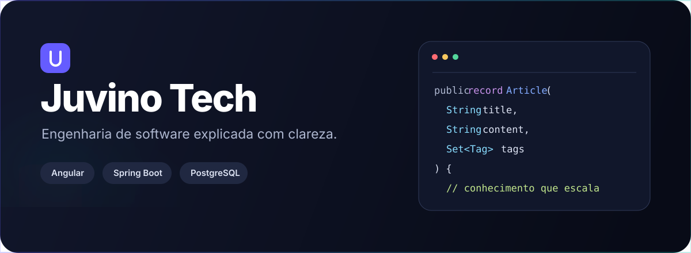
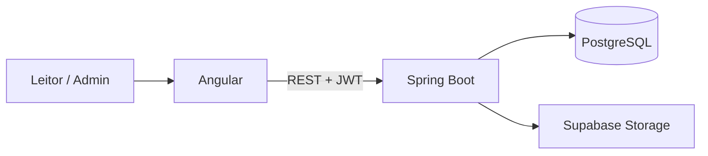

<div align="center">
  

  <br>

  [](https://angular.dev/)
  [](https://spring.io/projects/spring-boot)
  [](https://www.postgresql.org/)
  [](https://www.docker.com/)
  [](LICENSE)

  Blog técnico full-stack com experiência editorial moderna e um estúdio completo para publicação em Markdown.
</div>

## Sobre o projeto

O **Juvino Tech** é uma plataforma de conteúdo construída como projeto de portfólio. O produto combina uma interface rápida e responsiva com uma API segura para administrar artigos, categorias, tags e projetos relacionados.

O repositório demonstra decisões comuns em aplicações reais: autenticação JWT, migrações de banco, sanitização de conteúdo, pesquisa paginada, SEO dinâmico, temas claro e escuro, testes automatizados e ambiente reproduzível com Docker.

## Destaques

| Experiência de leitura | Administração | Engenharia |
|---|---|---|
| Busca, filtros e paginação | Login protegido por JWT | Arquitetura em camadas |
| Índice navegável por seção | Editor Markdown com preview | DTOs e validação na borda |
| Syntax highlighting e cópia | Rascunho e publicação | Migrações com Flyway |
| Tema claro/escuro | Taxonomias e projetos | CI e containers Docker |
| Conteúdo relacionado | Upload seguro de imagens | Erros padronizados e health check |

## Arquitetura



- O **frontend** concentra navegação, estado de autenticação, SEO e renderização segura do Markdown.
- O **backend** mantém regras de negócio em services, contratos em DTOs e persistência em repositories JPA.
- O **Flyway** versiona o schema; o Hibernate apenas valida sua compatibilidade.
- Imagens são enviadas pelo backend para que credenciais privilegiadas nunca cheguem ao navegador.

## Tecnologias

| Camada | Tecnologias |
|---|---|
| Frontend | Angular 20, TypeScript, RxJS, Marked, DOMPurify, Highlight.js |
| Backend | Java 17, Spring Boot 3.5, Spring Security, JPA, Bean Validation, Springdoc |
| Dados | PostgreSQL 17, Flyway |
| Infraestrutura | Docker Compose, GitHub Actions, Render, Supabase |
| Qualidade | Jasmine, Karma, JUnit 5, Mockito |

## Executando localmente

### Com Docker — recomendado

1. Copie o arquivo de exemplo:

   ```powershell
   Copy-Item .env.example .env
   ```

2. Revise as credenciais locais em `.env`. A senha do administrador deve ter no mínimo 10 caracteres.

3. Inicie a aplicação:

   ```bash
   docker compose up --build
   ```

| Serviço | Endereço |
|---|---|
| Aplicação | http://localhost:8081 |
| API | http://localhost:8080/api |
| Swagger | http://localhost:8080/swagger-ui.html |
| PostgreSQL | `localhost:5432` |

O administrador definido por `ADMIN_EMAIL` e `ADMIN_PASSWORD` é criado na primeira inicialização do banco.

### Sem Docker

Com PostgreSQL e Java 17 disponíveis, execute o backend:

```bash
cd backend
mvn spring-boot:run
```

Em outro terminal, inicie o frontend:

```bash
cd frontend
npm ci
npm start
```

A interface ficará disponível em http://localhost:4200.

## Configuração

| Variável | Responsabilidade |
|---|---|
| `DATABASE_URL` | URL JDBC do PostgreSQL |
| `DATABASE_USERNAME`, `DATABASE_PASSWORD` | Acesso ao banco |
| `JWT_SECRET` | Assinatura dos tokens; mínimo de 32 bytes |
| `JWT_EXPIRATION_MS` | Tempo de validade do token |
| `CORS_ALLOWED_ORIGINS` | Origens autorizadas, separadas por vírgula |
| `ADMIN_NAME`, `ADMIN_EMAIL`, `ADMIN_PASSWORD` | Bootstrap do administrador |
| `SUPABASE_URL`, `SUPABASE_SERVICE_KEY` | Acesso do backend ao Storage |
| `SUPABASE_STORAGE_BUCKET` | Bucket público das imagens |

> [!IMPORTANT]
> Nunca envie `.env`, senhas, tokens ou a service-role key do Supabase ao repositório. Não existe cadastro público; as rotas administrativas exigem um token válido.

## API

Rotas públicas principais:

```http
GET  /api/posts
GET  /api/posts/{slug}
GET  /api/categories
GET  /api/tags
GET  /api/projects
POST /api/auth/login
```

`GET /api/posts` aceita `q`, `category`, `tag`, `featured`, `page` e `size`. As rotas sob `/api/admin/**` exigem `Authorization: Bearer <token>`.

## Testes e qualidade

```bash
cd backend
mvn test

cd ../frontend
npm run lint
npm test
npm run build
```

O pipeline em `.github/workflows` repete testes e builds em pushes e pull requests.

## Estrutura do repositório

```text
blog/
├── backend/                 # API Spring Boot e migrações Flyway
├── frontend/                # Aplicação Angular
├── docs/                    # Recursos da documentação
├── .github/workflows/       # Integração contínua
├── docker-compose.yml       # Ambiente local completo
├── render.yaml              # Infraestrutura para deploy
└── .env.example             # Contrato das variáveis de ambiente
```

## Deploy

O projeto inclui Dockerfiles independentes e um `render.yaml`. Em produção, configure:

1. PostgreSQL e um bucket público no Supabase.
2. Backend no Render com `SPRING_PROFILES_ACTIVE=prod` e `/actuator/health` como health check.
3. Frontend como Static Site, publicando `frontend/dist/juvino-tech/browser`.
4. `CORS_ALLOWED_ORIGINS`, URLs de ambiente, `robots.txt` e `sitemap.xml` com os domínios finais.

## Autor

Desenvolvido por **João Juvino** como demonstração de engenharia de software full-stack, arquitetura e cuidado com experiência de produto.

- [GitHub](https://github.com/joao-juvino)
- [Portfólio](https://joao-juvino.github.io)

## Licença

Distribuído sob a licença MIT. Consulte [LICENSE](LICENSE) para mais informações.
